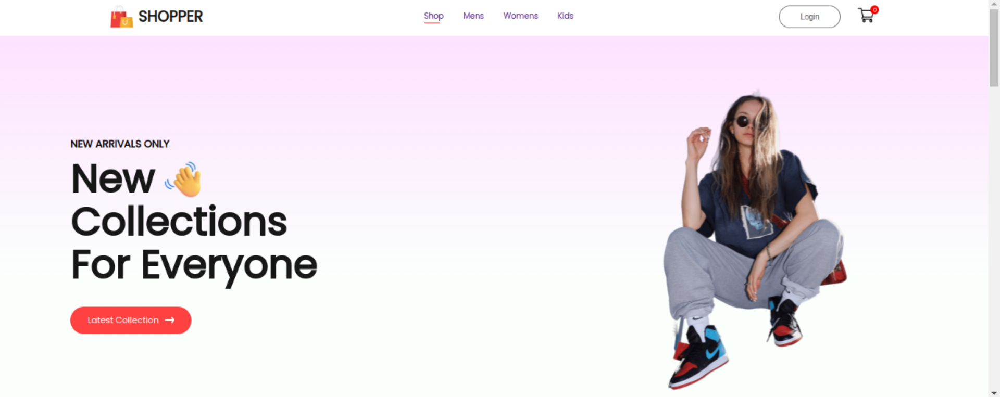
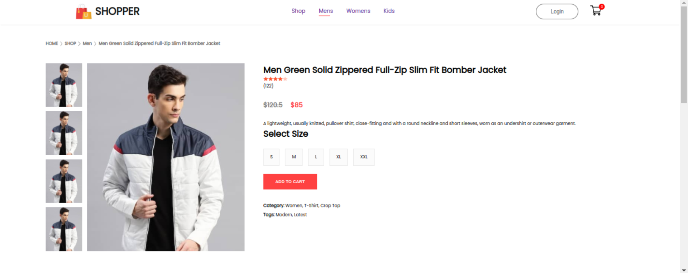

# 🛍️ E-Commerce Shopping Web App

## 🚀 Overview

Welcome to our E-Commerce Shopping Web App! This project is built using React + Vite, along with JavaScript, CSS, HTML, and JSX. It offers a seamless and interactive shopping experience with essential features like context API, states, and props to manage data efficiently.

## 🔥 Features

- 🏠 **Landing Page - Engaging homepage with featured products**

- 🛒 **Cart Page - Add, remove, and view selected items**

- 📦 **Category Page - Shop by category: Men, Women, and Kids**

- 🔐 **Signup/Login Page - User authentication for personalized shopping**

- 👕 **Product Page - Detailed product view with images and descriptions**

## 🛠️ Tech Stack

- **⚡ React + Vite for fast development**

- **🎨 CSS for styling**

- **🏗️ HTML & JSX for structuring components**

- **🌐 Context API for global state management**

## 🌟 Preview  

### 🏠 Landing Page  
  

### 🛍️ Product Page  
  

### 🛒 Category Page  
  

### 🛒 Cart Page  
  

Enjoy a seamless shopping experience! 🎉
